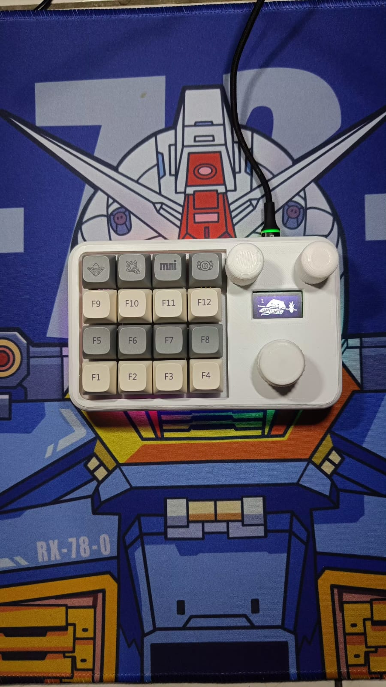
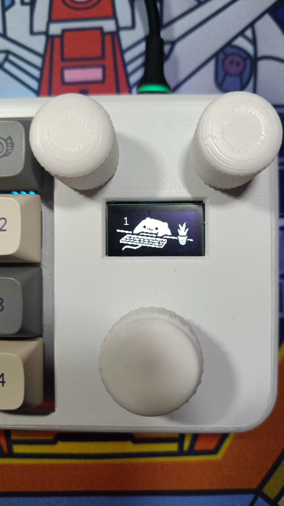
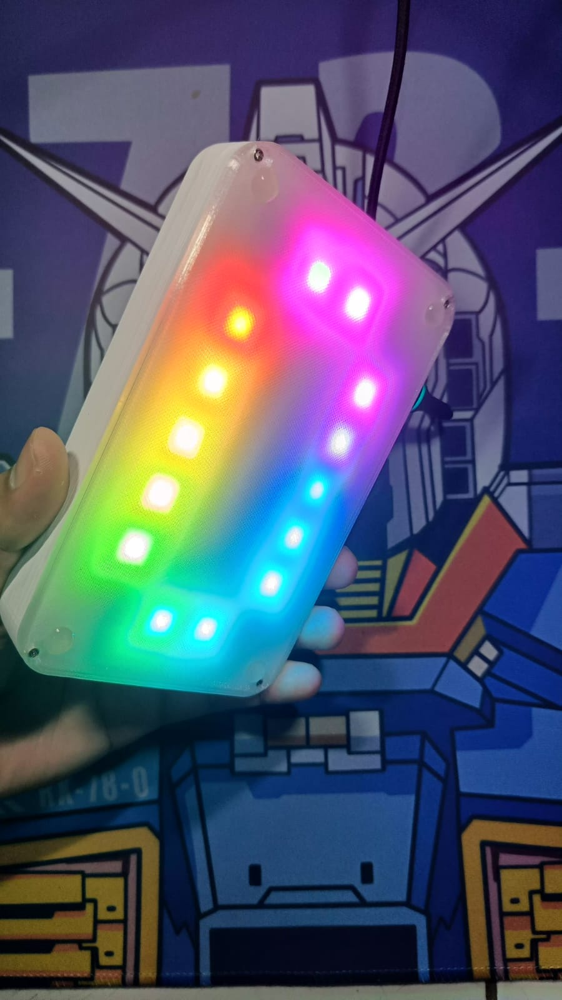
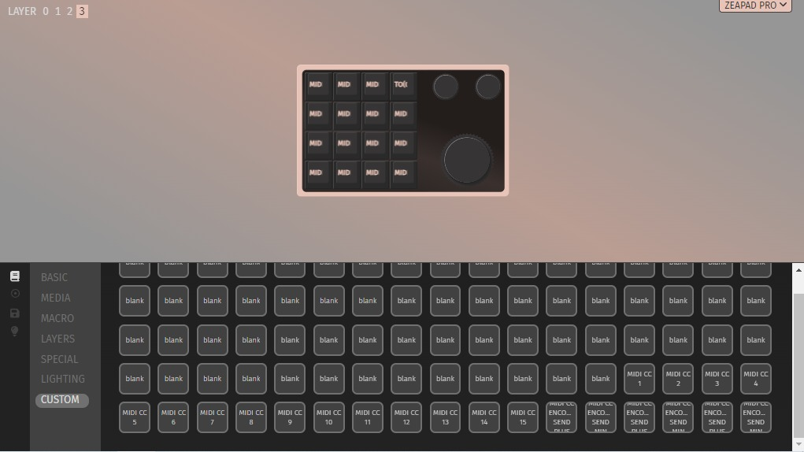
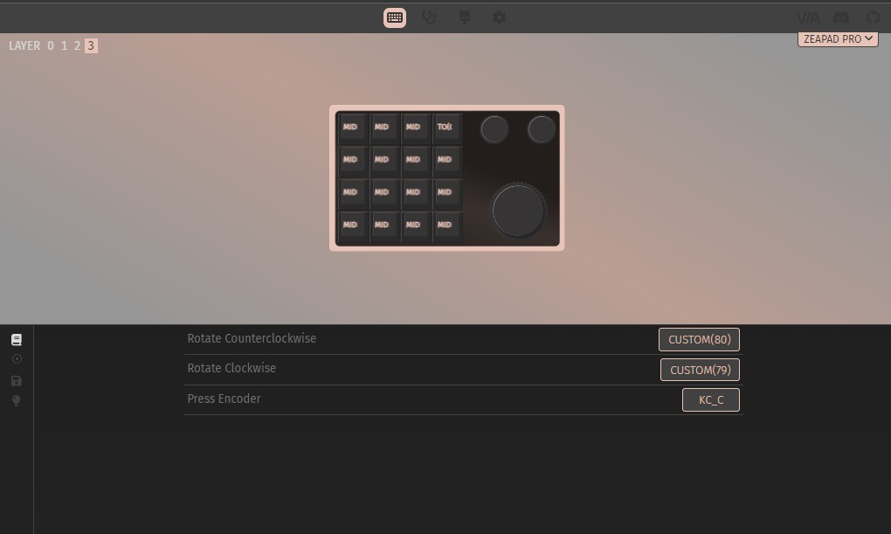

# Zeapad-Pro-QMK-VIA
This is Macropad that have function like keyboard but you can setting/proggrammed every single key with anything you want. This macropad also have feature MACRO, it mean you just need prees a single swith for Combination Key. All Function can be setting in Apps named VIA. Then you can buy it in this [TOKOPEDIA](https://tokopedia.link/HMb2O1O1eJb) 
Many people use it for help they for Computer Task Like Edithing Vidio or Excel Formula shortcut

## Table of Content
* [Product Specsification](#product-specsification)
* [Download VIA](#download-via)
* [Load JSON File](#load-json-file)
* [Link Keycode QMK](#Link-keycode-qmk)
* [Tutorial VIA Usage](#tutorial-via-usage)
* [Cara Setting Knob](#cara-setting-knob)
* [How To use MACRO](#how-to-use-macro)
* [Preview Hardware](#preview-hardware)
* [Preview VIA](#preview-via)
* [Cara Update/Upgrade Firmware](#cara-update/upgrade-firmware)
* [MIDI2LR Usage](#midi2lr-usage)
* [Documentation](#documentation)
  * [Pinout Diagram](#pinout-diagram)
  * [Dimension](#dimension)
  * [BOM](#bom)
  * [Schematic](#schematic0)
  * [Example Program](#examples-program)
* [FAQ](#FAQ)

## Product Specsification
- STM32F401 as Microcontroller
- QMK Firmware
- Support VIA, all key and knob can proggrammed
- RGB Underglow
- 4x Layer 
- 16x Switch , 3 Knob Encoder and 1 OLED LAyer
- Hotswap Switch
- 3D Case 
- USB type C

## Download VIA
Link Download VIA(Pilih sesuai OS) : https://github.com/the-via/releases/releases
VIA WEB VERSION : https://usevia.app/

## Load JSON File
- Connect your macropad to PC
- Open VIA
- In Tab Setting, enable "Show Design Tab"
- Open Design Tab
- Load file with name "zeapad_via_definitions.json" , you can download in this [link](https://github.com/juarendra/Zeapad-Pro-QMK-VIA/blob/main/zeapadpro_via_definitions%20.json)
- Open Configure Tab to setting your macropad
- If nothing happend , do it again from first

## Link Keycode QMK
- mouse : https://github.com/qmk/qmk_firmware/blob/master/docs/feature_mouse_keys.md
- keyboard : https://github.com/qmk/qmk_firmware/blob/master/docs/keycodes.md

## Tutorial VIA Usage
- https://docs.keeb.io/via

## Cara Setting Knob
- Untuk melakukan setting di knob perlu memasukan command berupa keycode qmk, Jadi cara nya sama dengan melakuykan setting dengan Any key seperti petunjuk pada link berikut: 
https://docs.keeb.io/via

Here's some examples:

- LALT(KC_TAB) - Sends Alt-Tab
- LCTL(KC_C) - Sends Ctrl-C
- LGUI(KC_C) - Sends Cmd-C or Win-C
- LSFT(LCTL(KC_END)) - Sends Shift-Ctrl-End
- MO(1) - Momentarily turn on layer 1
- LCA(KC_DEL) - Sends Ctrl-Alt-Del
- MT(MOD_RSFT, KC_ENT) - Sends Shift if held, Enter if tapped
- MACRO (0) - macro 0

## How To use MACRO
you can read on [this file](https://github.com/juarendra/STREAMPAD-QMK-VIA/blob/main/DOC/MACRO%20VIA%20USAGE.pdf)
or you can read on this [web](https://www.keychron.com/blogs/archived/how-to-use-via-to-program-your-keyboard)
or you can see video [youtube](https://youtu.be/GtSeo69Y0Zw)

## Preview Hardware

  
  
  

## Preview VIA

https://github.com/juarendra/Zeapad-Pro-QMK-VIA/assets/43043633/afd7e68e-0a54-4b18-be12-b96c0f13611a

## Cara Update/Upgrade Firmware
- Siapkan dahulu macropad, kabel usb dan firmware yang ingin di update/upgrade ke macropad anda
- Siapkan Firmware yang akan digunakan untuk update/upgrade
- Download Software QMK Toolbox di [link berikut](https://github.com/qmk/qmk_toolbox/releases)
- Install Software QMK Toolbox, Install Semua drivernya. setelah siap anda dapat meload Firmware yang seblumnya. Lalu Centang Auto-Flash seperti gambar dibawah

  

- Colok kabel ujung usb type C ke macropad tanpa mencolokannya dahulu ke USB PC anda
- Tekan dan tahan tombol yang berada di ujung atas kiri. lalu colokan Ujung USB yang sebelum ke USB PC anda sambil tetap menahan tombol sebelum nya sebentar
- Setelah ada bunyi/notif USB masuk. anda dapat melepaskan tombol knobnya
- Maka secara otomatis macropad akan terflash. jika selesai maka tampilan QMK toolbox akan seperti gambar dibawah

  

## MIDI2LR Usage
MIDI2LR adalah extension dari Adobe Ligtroom yang berguna untuk mengkonversi inputan MIDI dari Midi controller menjadi perintah perintah Lightroom. Salah satu fitur QMK adalah dapat dijadikan sebuah midi controller, sehingga pada dibutalah firmware QMK yang dapat mendukung fitur midi controller pada macropad ZEAPAD PRO tersebut. 

untuk mempelajari penggunaan MIDI2LR and dapat melihat VIDEO [berikut](https://www.youtube.com/watch?v=VDSN_Vz6U04&t=319s).

untuk menggunakan zeapad pro sebagai midi controller anda dapat memasukan keycode midi controller yang ada di link [berikut](https://docs.qmk.fm/features/midi) ke ANY KEY pada aplikasi VIA, seprti contohnya keycode "MI_C" untuk mengirimkan note C, "MI_D" untuk mengirimkan note D

Untuk mengirimkan CC atau Control Change anda dapat memasukan keycode pada TAB "Custom" di aplikasi VIA seperti gambar dibawah

  
  

berikut merupakan penjelasan keycode keycode yang ada pada TAB "Custom". abaikan keycode dengan nama "blank". Semua keycode dibawah ini sudah di lakukan preset di layer ke 4

| Keycode    | Function             |  Penjelasana         | 
| ---------- | -------------------- | -------------------- |
| MIDI CC 1  | Memilih CC 1 untuk encoder 1, CC 16 untuk encoder 2 dan CC 31 untuk encoder 3| dengan menekan keycode ini anda akan memilihi CC tersebut sehingga pada saat anda memutar knob/encoder yang berkaitan maka akan mengirimkan CC yang terpilih sebelumnya sesuai dengan encoder/knob yang di putar|
| MIDI CC 2  | Memilih CC 2 untuk encoder 1, CC 17 untuk encoder 2 dan CC 32 untuk encoder 3| dengan menekan keycode ini anda akan memilihi CC tersebut sehingga pada saat anda memutar knob/encoder yang berkaitan maka akan mengirimkan CC yang terpilih sebelumnya sesuai dengan encoder/knob yang di putar|
| MIDI CC 3  | Memilih CC 3 untuk encoder 1, CC 18 untuk encoder 2 dan CC 33 untuk encoder 3| dengan menekan keycode ini anda akan memilihi CC tersebut sehingga pada saat anda memutar knob/encoder yang berkaitan maka akan mengirimkan CC yang terpilih sebelumnya sesuai dengan encoder/knob yang di putar|
| MIDI CC 4  | Memilih CC 4 untuk encoder 1, CC 19 untuk encoder 2 dan CC 34 untuk encoder 3| dengan menekan keycode ini anda akan memilihi CC tersebut sehingga pada saat anda memutar knob/encoder yang berkaitan maka akan mengirimkan CC yang terpilih sebelumnya sesuai dengan encoder/knob yang di putar|
| MIDI CC 5  | Memilih CC 5 untuk encoder 1, CC 20 untuk encoder 2 dan CC 35 untuk encoder 3| dengan menekan keycode ini anda akan memilihi CC tersebut sehingga pada saat anda memutar knob/encoder yang berkaitan maka akan mengirimkan CC yang terpilih sebelumnya sesuai dengan encoder/knob yang di putar|
| MIDI CC 6  | Memilih CC 6 untuk encoder 1, CC 21 untuk encoder 2 dan CC 36 untuk encoder 3|  dengan menekan keycode ini anda akan memilihi CC tersebut sehingga pada saat anda memutar knob/encoder yang berkaitan maka akan mengirimkan CC yang terpilih sebelumnya sesuai dengan encoder/knob yang di putar|
| MIDI CC 7  | Memilih CC 7 untuk encoder 1, CC 22 untuk encoder 2 dan CC 37 untuk encoder 3|  dengan menekan keycode ini anda akan memilihi CC tersebut sehingga pada saat anda memutar knob/encoder yang berkaitan maka akan mengirimkan CC yang terpilih sebelumnya sesuai dengan encoder/knob yang di putar|
| MIDI CC 8  | Memilih CC 8 untuk encoder 1, CC 23 untuk encoder 2 dan CC 38 untuk encoder 3|  dengan menekan keycode ini anda akan memilihi CC tersebut sehingga pada saat anda memutar knob/encoder yang berkaitan maka akan mengirimkan CC yang terpilih sebelumnya sesuai dengan encoder/knob yang di putar|
| MIDI CC 9  | Memilih CC 9 untuk encoder 1, CC 24 untuk encoder 2 dan CC 39 untuk encoder 3|  dengan menekan keycode ini anda akan memilihi CC tersebut sehingga pada saat anda memutar knob/encoder yang berkaitan maka akan mengirimkan CC yang terpilih sebelumnya sesuai dengan encoder/knob yang di putar|
| MIDI CC 10  | Memilih CC 10 untuk encoder 1, CC 25 untuk encoder 2 dan CC 40 untuk encoder 3|  dengan menekan keycode ini anda akan memilihi CC tersebut sehingga pada saat anda memutar knob/encoder yang berkaitan maka akan mengirimkan CC yang terpilih sebelumnya sesuai dengan encoder/knob yang di putar|
| MIDI CC 11  | Memilih CC 11 untuk encoder 1, CC 26 untuk encoder 2 dan CC 41 untuk encoder 3|  dengan menekan keycode ini anda akan memilihi CC tersebut sehingga pada saat anda memutar knob/encoder yang berkaitan maka akan mengirimkan CC yang terpilih sebelumnya sesuai dengan encoder/knob yang di putar|
| MIDI CC 12  | Memilih CC 12 untuk encoder 1, CC 27 untuk encoder 2 dan CC 42 untuk encoder 3|  dengan menekan keycode ini anda akan memilihi CC tersebut sehingga pada saat anda memutar knob/encoder yang berkaitan maka akan mengirimkan CC yang terpilih sebelumnya sesuai dengan encoder/knob yang di putar|
| MIDI CC 13  | Memilih CC 13 untuk encoder 1, CC 28 untuk encoder 2 dan CC 43 untuk encoder 3|  dengan menekan keycode ini anda akan memilihi CC tersebut sehingga pada saat anda memutar knob/encoder yang berkaitan maka akan mengirimkan CC yang terpilih sebelumnya sesuai dengan encoder/knob yang di putar|
| MIDI CC 14  | Memilih CC 14 untuk encoder 1, CC 29 untuk encoder 2 dan CC 44 untuk encoder 3|  dengan menekan keycode ini anda akan memilihi CC tersebut sehingga pada saat anda memutar knob/encoder yang berkaitan maka akan mengirimkan CC yang terpilih sebelumnya sesuai dengan encoder/knob yang di putar|
| MIDI CC 15  | Memilih CC 15 untuk encoder 1, CC 30 untuk encoder 2 dan CC 45 untuk encoder 3|  dengan menekan keycode ini anda akan memilihi CC tersebut sehingga pada saat anda memutar knob/encoder yang berkaitan maka akan mengirimkan CC yang terpilih sebelumnya sesuai dengan encoder/knob yang di putar|
| MIDI CC ENCODER1 SEND PLUS  | Mengirimkan CC yang terpilih untuk encoder/knob 1 dengan value 65 | keycode ini perlu di daftarkan ke encoder/knob pada orientasi clockwise agar dapat mengatur menaikan value CC yang sesuai di encoder/ knob 1 |
| MIDI CC ENCODER1 SEND MIN  | Mengirimkan CC yang terpilih untuk encoder/knob 1 dengan value 63 | keycode ini perlu di daftarkan ke encoder/knob pada orientasi anticlockwise agar dapat mengatur menaikan value CC yang sesuai di encoder/ knob 1 |
| MIDI CC ENCODER2 SEND PLUS  | Mengirimkan CC yang terpilih untuk encoder/knob 2 dengan value 65 | keycode ini perlu di daftarkan ke encoder/knob pada orientasi clockwise agar dapat mengatur menaikan value CC yang sesuai di encoder/ knob 2 |
| MIDI CC ENCODER2 SEND MIN  | Mengirimkan CC yang terpilih untuk encoder/knob 2 dengan value 63 | keycode ini perlu di daftarkan ke encoder/knob pada orientasi anticlockwise agar dapat mengatur menaikan value CC yang sesuai di encoder/ knob 2  |
| MIDI CC ENCODER3 SEND PLUS  | Mengirimkan CC yang terpilih untuk encoder/knob 3 dengan value 65 | keycode ini perlu di daftarkan ke encoder/knob pada orientasi clockwise agar dapat mengatur menaikan value CC yang sesuai di encoder/ knob 3 |
| MIDI CC ENCODER3 SEND MIN  | Mengirimkan CC yang terpilih untuk encoder/knob 3 dengan value 63| keycode ini perlu di daftarkan ke encoder/knob pada orientasi anticlockwise agar dapat mengatur menaikan value CC yang sesuai di encoder/ knob 2 |
